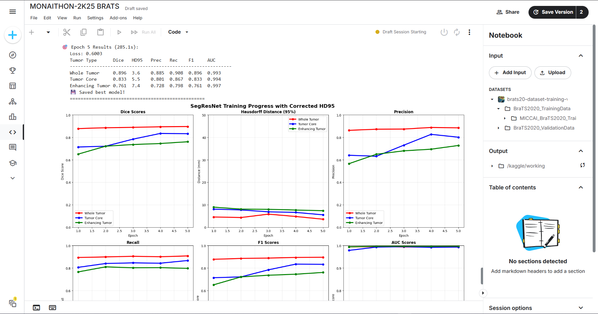
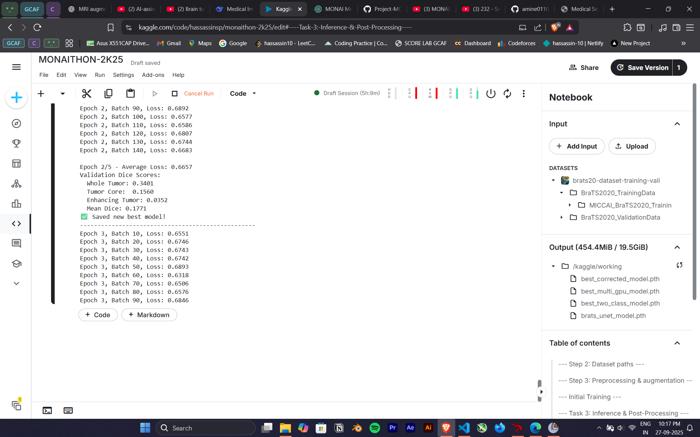
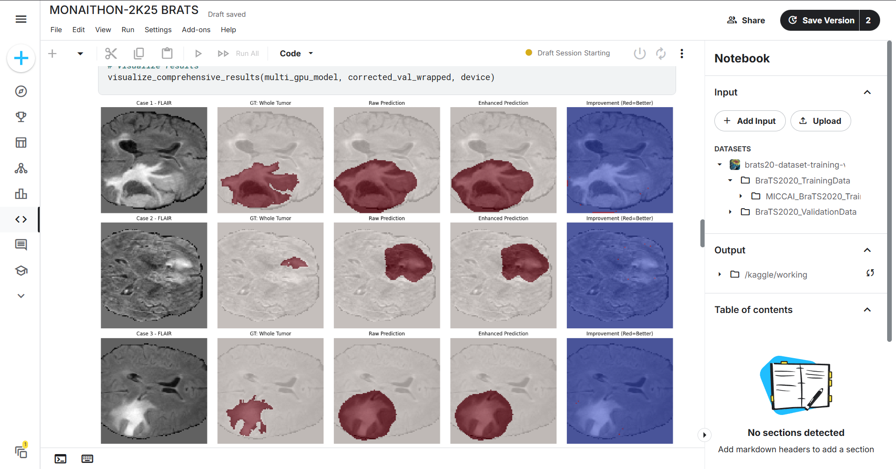
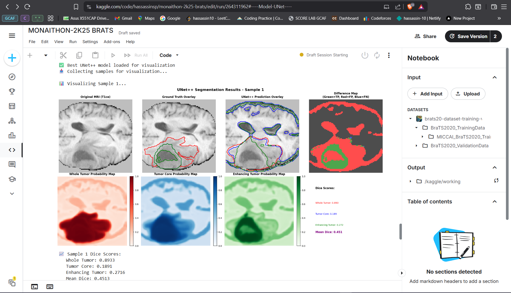
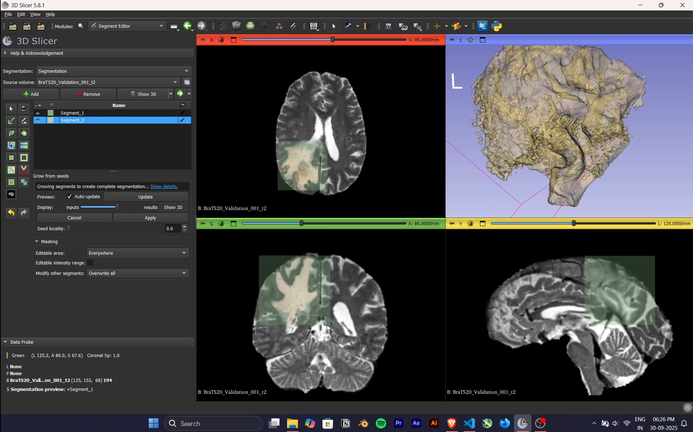

# 🧠 BRATS 2020 Brain Tumor Segmentation with MONAI

This repository contains a **baseline 3D UNet pipeline** built using [MONAI](https://monai.io/) for the **BRATS 2020 dataset**.  
It demonstrates preprocessing, training, evaluation, and inference workflows for multi-class brain tumor segmentation.

🔗 **Original Kaggle Project**: [monaithon-2k25-brats](https://www.kaggle.com/code/hassassinsp/monaithon-2k25-brats)

---

## 📌 Project Overview

- **Task**: Segment brain tumors from 3D MRI scans
- **Dataset**: [BRATS 2020](https://www.kaggle.com/datasets/awsaf49/brats20-dataset-training-validation) (369 training cases)
- **Frameworks**: MONAI + PyTorch
- **Model**: Baseline **3D UNet** with residual connections
- **Loss**: Dice Loss
- **Optimizer**: Adam

---

## ⚙️ Pipeline Components

### 1. **Preprocessing** 📥
- Resampling to uniform spacing
- Orientation standardization (RAS)
- Intensity normalization
- Random cropping, flips, rotations
- Gaussian noise augmentation

### 2. **Training** 🏋️
- 3D UNet architecture with residual units
- Dice Loss + Adam Optimizer
- Mixed precision training support
- Checkpoint saving for best model
- Training history logging

### 3. **Evaluation** 📊
- **Dice Score**: Segmentation similarity
- **Hausdorff95**: Boundary distance
- **Sensitivity**: True positive rate
- **Specificity**: True negative rate
- Per-region metrics (WT, TC, ET)

### 4. **Inference** 🔮
- Single patient prediction
- Batch inference for multiple patients
- NIfTI output format

---

## 🚀 Quick Start

### 1. Install Dependencies
```bash
pip install -r requirements.txt
```

### 2. Download Dataset
```bash
# From Kaggle: https://www.kaggle.com/datasets/awsaf49/brats20-dataset-training-validation
# Extract to: data/BRATS_2020_training_data/
```

### 3. Configure & Train
```bash
# Edit config.py for your settings
python train.py
```

### 4. Evaluate
```bash
python evaluate.py checkpoints/best_model.pth data/val
```

### 5. Predict
```bash
# Single patient
python inference.py checkpoints/best_model.pth data/test/patient_001/

# Batch
python inference.py checkpoints/best_model.pth data/test/ --batch
```

---

## 📁 Project Structure

```
brain/
├── MONAITHON-2K25/                    # Original Kaggle work
│   └── MONAITHON-2K25/
│       ├── monaithon-2k25-brats.ipynb # Main notebook
│       ├── README.md                  # Original documentation
│       ├── LICENSE
│       └── assets/                    # Visualizations & results
│
├── config.py                          # Training configuration
├── utils.py                           # Helper functions
├── train.py                           # Training script
├── evaluate.py                        # Evaluation metrics
├── inference.py                       # Prediction script
├── requirements.txt                   # Dependencies
├── .gitignore                         # Git ignore
├── README.md                          # This file
└── README_SETUP.md                    # Detailed setup guide
```

---

## 📊 Results & Visualizations

### Training Curve


### Sample MRI Slices
<div style="display: flex; gap: 10px;">
  
  
</div>

### Segmentation Results
<div style="display: flex; gap: 10px;">
  
  
</div>

### 3D Tumor Visualization


_(Images generated from BRATS 2020 training cases)_

---

## 🔧 Configuration

### Training (`config.py`)
```python
TRAIN_CONFIG = {
    "num_epochs": 100,
    "batch_size": 2,
    "learning_rate": 1e-4,
    "weight_decay": 1e-5,
    "device": "cuda",
}
```

### Model Architecture
```python
MODEL_CONFIG = {
    "in_channels": 4,      # T1, T1ce, T2, FLAIR
    "out_channels": 4,     # Background, Necrotic, Edema, Enhancing
    "channels": (32, 64, 128, 256, 512),
    "strides": (2, 2, 2, 2),
    "num_res_units": 2,
}
```

### Data Augmentation
```python
AUG_CONFIG = {
    "rotate_range": (0.2, 0.2, 0.2),
    "scale_range": (0.9, 1.1),
    "flip_prob": 0.5,
    "noise_std": 0.01,
}
```

See [`README_SETUP.md`](README_SETUP.md) for detailed configuration guide.

---

## 🎯 BRATS Regions

- **WT (Whole Tumor)**: All tumor regions (labels 1, 2, 3)
- **TC (Tumor Core)**: Necrotic + Enhancing (labels 1, 3)
- **ET (Enhancing Tumor)**: Only enhancing region (label 3)

```
Label 0: Background
Label 1: Necrotic/Core
Label 2: Edema
Label 3: Enhancing Tumor
```

---

## 🔮 Future Enhancements

- [ ] **Advanced Architectures**: UNet++, SegResNet, Swin UNETR
- [ ] **Better Augmentation**: Elastic deformation, histogram matching
- [ ] **Ensemble Methods**: Multiple model predictions
- [ ] **Full Metrics**: ROC/PR curves, ablation studies
- [ ] **Web Deployment**: Streamlit/Gradio demo app
- [ ] **Model Explainability**: Attention maps, feature visualization

---

## 📚 References

- [MONAI Documentation](https://monai.io/)
- [MONAI Tutorials](https://github.com/Project-MONAI/tutorials)
- [BRATS 2020 Challenge](https://www.med.upenn.edu/cbica/brats2020/)
- [U-Net: Convolutional Networks for Biomedical Image Segmentation](https://arxiv.org/abs/1505.04597)
- [PyTorch](https://pytorch.org/)

---

## 👥 Authors

**Hackathon Team** — _Ctrl+Alt+Heal_  
**Competition**: Monaithon 2K25

---

## 📜 License

See [`MONAITHON-2K25/MONAITHON-2K25/LICENSE`](MONAITHON-2K25/MONAITHON-2K25/LICENSE)

---

## 📞 Support

For issues or questions:
1. Check [`README_SETUP.md`](README_SETUP.md) for detailed setup guide
2. Review the original [Kaggle notebook](https://www.kaggle.com/code/hassassinsp/monaithon-2k25-brats)
3. Refer to [MONAI documentation](https://monai.io/documentation.html)

---

**Last Updated**: 2026-09-28  
**Status**: ✅ Core pipeline implemented | ⏳ Full evaluation pending | 📋 Demo app coming soon
